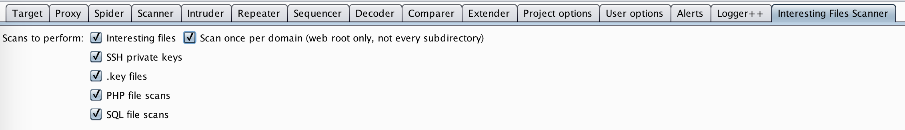

# Interesting Files Scanner
## About
<b>Interesting Files Scanner</b> extends Burp Suite's active scanner, with scans for interesting files and directories.
A main feature of the extension is the check for false positives with tested patterns for each case. Furthermore,
a Burp Suite tab is present to select/unselect the checks, to avoid network overload. 

For example the following file checks are implemented:

* Interesting Files such as .git/config
* SSH private keys
* Various .key files
* Common PHP files and the corresponding backup files
* SQL database files

## Configuration
You can configure the check <b>Interesting Files Scanner</b> will perform, simply select the new tab in Burp
Suite and select the file checks that may apply to your scenario.

Furthermore, you can specify if you want <b>Interesting Files Scanner</b> to scan all subdirectories discovered
on the target domain. Therefore, unselect the checkbox <i>'Scan once per domain'</i>, which is selected by 
default.

## Requirements
This extension requires Burp Suite Professional and Jython 2.5 or later standalone. (http://www.jython.org)

## Contributes to
The project was inspired by the following projects:
* https://github.com/hannob/snallygaster
* https://github.com/albinowax/ActiveScanPlusPlus
* https://github.com/unamer/CTFHelper/blob/master/CTFhelper.py

## Contact
Please feel free to contact, if you miss any interesting file checks or discover any bugs. 
Only file checks with sufficient patterns, to avoid false positives, can be implemented.
